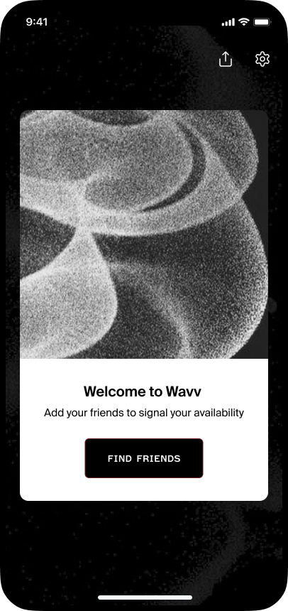

<p align="center" style="background-color: #F8A65D;">
    <h1 align="center">Wavv</h1>
</p>
<h4 align="center">Wavv is a mobile app powered by the Internet Computer Protocol (ICP), creating a transparent, community-owned platform for decentralized social networking. It simplifies social planning by allowing users to signal their daily availability, share basic outing details, and view friends' availability status.</h4>

<br />


---

<p align="center">
  
  
  
  
  
</p>


## How to Run the Project

Follow these steps to run the project:

1. Clone the repository:
   ```bash
   git clone https://github.com/wavvapp/sac-frontend.git
   ```

2. Navigate to the project directory:
   ```bash
   cd sac-frontend
   ```

3. Install dependencies:
   ```bash
   npm install
   ```

4. Start the Expo development server:
   ```bash
   npx expo start
   ```

5. Scan the QR code with the Expo Go app on your mobile device to view the app.

## Development Workflow

Our development workflow follows these principles:

1. **Single Source of Truth**: We use the `main` branch as the single source of truth for our codebase.

2. **Feature Development**:
   - Create a feature branch from `main` for each new feature or bug fix
   - Name branches according to the pattern: `feature/feature-name` or `fix/bug-name`
   - Keep branches focused on a single task or related set of changes

3. **Pull Requests**:
   - All changes must be submitted through pull requests
   - Pull requests require code review before merging
   - Ensure all tests pass before merging to `main`

4. **Merging Strategy**:
   - Squash and merge feature branches to maintain a clean history on `main`
   - Keep commit messages clear and descriptive

5. **Releases**:
   - Releases are tagged from the `main` branch
   - We use semantic versioning for our releases

Always pull the latest changes from `main` before starting new work to ensure you're working with the most up-to-date codebase.

### Hotfix Process

For urgent fixes to production:

1. Create a hotfix branch from the production tag: `git checkout -b hotfix/issue-description-v1.2.3`
2. Make the necessary fixes
3. Create a pull request to merge into `main`
4. After approval and merge, follow the standard release process with an incremented patch version

Remember that all code flows through the `main` branch.
