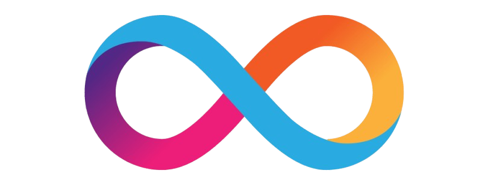

<p align="center" style="background-color: #F8A65D;">
    <h1 align="center">Wavv</h1>
</p>
<h4 align="center">Wavv is a mobile app powered by the Internet Computer Protocol (ICP), creating a transparent, community-owned platform for decentralized social networking. It simplifies social planning by allowing users to signal their daily availability, share basic outing details, and view friends' availability status.</h4>

<br />


---

<p align="center">
  
  
  
  
  
</p>


## How to Run the Project

Follow these steps to run the project:

1. Clone the repository:
   ```bash
   git clone https://github.com/wavvapp/sac-frontend.git
   ```

2. Navigate to the project directory:
   ```bash
   cd sac-frontend
   ```

3. Install dependencies:
   ```bash
   npm install
   ```

4. Start the Expo development server:
   ```bash
   npx expo start
   ```

5. Scan the QR code with the Expo Go app on your mobile device to view the app.


## Powered by: 

<p align="center">
  
  
</p>
